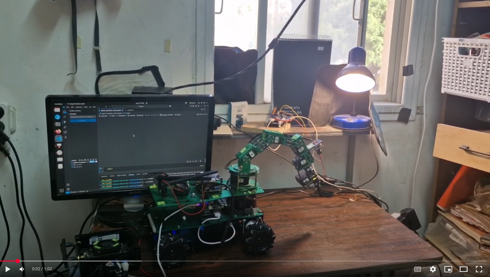
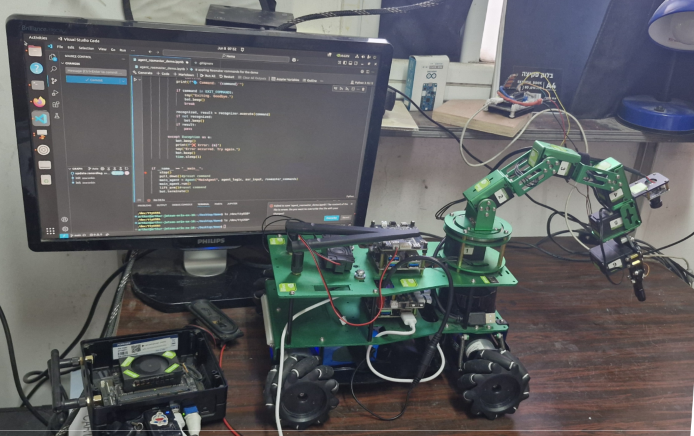

# 🎙️ Voice-Controlled Robot Agent using NVIDIA NeMo + ROSMASTER

https://youtu.be/SUPT8yU3pgg

[](https://youtu.be/SUPT8yU3pgg "Voice Agent Rosmaster")

## 🧠 Project Overview

This project demonstrates an **offline speech-to-action system** using NVIDIA NeMo and a ROSMASTER X3PLUS robot controlled via Jetson Orin NX. It implements a voice-controlled agent that listens to commands, parses intents, and triggers robot actions accordingly (e.g., movement, arm lift, sound). The system features:

- Automatic Speech Recognition (ASR)
- Text-to-Speech (TTS) responses
- Intent classification (Adapt Parser + Fuzzy Matching)
- Robotic control via USB serial

## 🗂️ Project Structure

```
project/
├── agent.py                    # Core Agent class and event loop
├── nemo_speech.py              # ASR + TTS via NeMo (Tacotron2 + HifiGAN)
├── phrase_to_function.py      # Command mapping using Adapt + Fuzzy
├── recorder.py                # Microphone recording and playback
├── rosmaster_arm.py           # Arm control via serial
├── rosmaster_motor.py         # Motor control via serial
├── rosmaster_create_bot.py    # Robot abstraction (arm, motor, buzzer)
├── agent_demo.ipynb           # Basic agent demo notebook
├── agent_rosmaster_demo.ipynb # Full agent controlling the robot
└── requirements.txt
```

## 🎤 Voice-to-Action Flow

The `Agent` listens for commands using `VoiceRecorder`, transcribes them via `NemoSpeech`, and maps them to robot actions using `PhraseToFunction`.

### `nemo_speech.py`
Uses NVIDIA NeMo:
- `transcribe_from_audio()` for ASR
- `text_to_speech()` using Tacotron2 + HifiGAN

### `recorder.py`
Captures microphone input:
- `record()` starts a temporary recording
- `get_audio()` retrieves the recorded audio
- `play()` can playback TTS output

### `phrase_to_function.py`
Maps phrases to actions:
- Uses `AdaptIntentParser` (keywords)
- Falls back to fuzzy string matching if intent is unclear

### `agent.py`
Main coordination class:
- Loops over audio input
- Routes input to command mappings
- Handles errors and exit gracefully

## 🤖 ROSMASTER X3PLUS Integration

The robot used is the **Yahboom ROSMASTER X3PLUS**, a programmable car platform based on Jetson + serial-controlled extension board.

It includes:
- DC motors (front/rear drive)
- 6DOF robotic arm
- Buzzer, sensors, LED control
- USB connection (`/dev/ttyUSB0`)

### `rosmaster_motor.py`
Controls:
- `move_forward()`
- `move_backward()`
- `move_turn1()` / `stop()`
- `set_speed()`

### `rosmaster_arm.py`
Controls:
- `arm_bent_up(deg)`
- `arm_bent_down(deg)`
- Multi-joint positioning (for future upgrades)

### Demo Actions in `agent_rosmaster_demo.ipynb`

Commands supported:
- `"say hi"` — speaks a greeting
- `"move forward"` — moves forward briefly
- `"turn around"` — rotates the bot
- `"lift arm"` / `"arm down"` — controls the robotic arm
- `"stop"` — halts the bot
- `"turn off the lamp"` — optional external command via `requests`

## 🖥️ How to Run

1. Connect:
   - USB microphone
   - ROSMASTER via `/dev/ttyUSB0` (check your device address before)

2. Run:

```bash
python3 agent_rosmaster_demo.ipynb  # or agent_demo.ipynb for test
```

3. Speak commands in English, e.g.:
   - "move forward"
   - "lift arm"
   - "say hi"
   - "exit"

## 🛠 Installation (To Be Expanded)

You need:
- Python 3.10
- Jetson Orin NX 16GB or x86_64 w/ GPU
- NVIDIA NeMo Toolkit
- `sounddevice`, `numpy`, `pyserial`, `fuzzywuzzy`, `adapt-parser`

```bash
pip install -r requirements.txt
```

> For NeMo models, you can use pre-downloaded `.nemo` checkpoints or let it fetch automatically on first run.

## 📷 Screenshots



## ⚠️ Disclaimer

This code was written as a **demo for NVIDIA Jetson platforms**. Use at your own risk. The author **assumes no responsibility** for damage, injury, or unintended behavior caused by this software or hardware interaction.

## © License

MIT License or Creative Commons Zero (to be confirmed). This code is provided for educational, research, or demonstration purposes.
